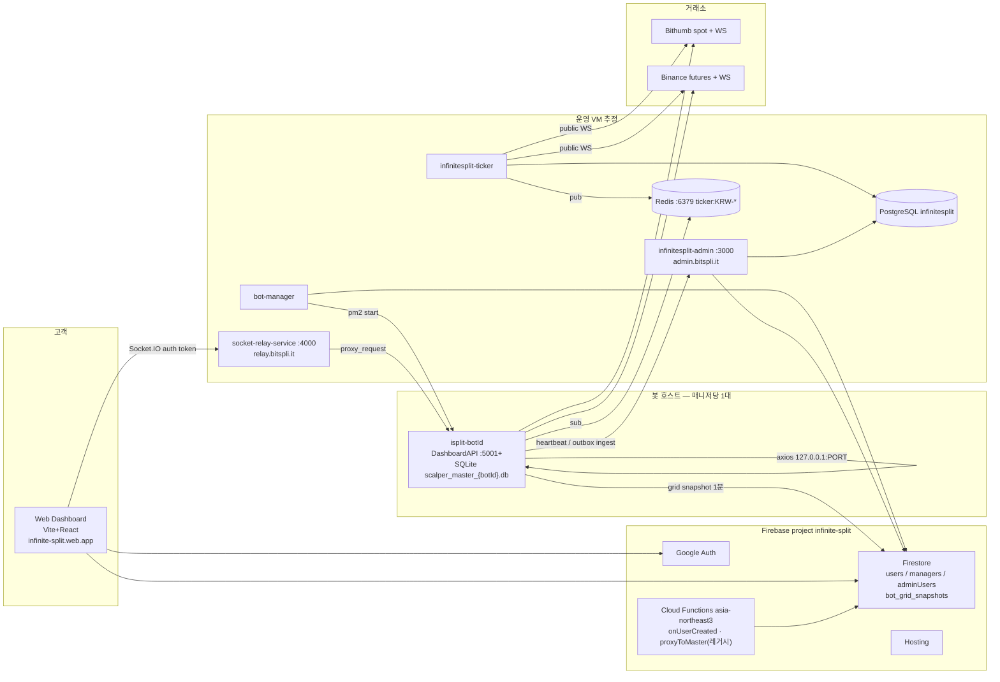

# InfiniteSplit Handover

스냅샷: **2026-08-21**. 소스 오브 트루스 = 이 문서 + 실코드. 레거시 md(`HOWTOINSTALL.md`, `GUIDE.md`, `dashboard-socket-migration-guide.md`, `Implementation Plan*`)와 충돌하면 **코드와 이 핸드오프**를 따른다. 시크릿·토큰·API 키 값은 적지 않는다.

이 워크스페이스(`/workspace`)는 umbrella `https://github.com/postklee15/infinitesplit-workspace` (`main` `f3fc9e0`). 자식 4개는 git submodule이며, 이 환경의 clone은 **shallow(커밋 1개)** 다. GitHub `gh`는 PATH에 없음. 자식 원격 fetch는 인증 없이 실패한다.

---

## 1. 제품이 하는 일

InfiniteSplit(코드명 Hedge Master Pro Phase 3)은 **빗썸 현물 롱 스플릿 + 바이낸스 선물 숏 스플릿 + 위기 헷지**를 한 봇 프로세스에서 돌리는 멀티테넌트 자동매매 시스템이다.

- 고객은 Firebase Google 로그인 → 승인 대기 → 전용 봇 프로세스(`isplit-{botId}`)가 할당된다.
- 고객 대시보드는 봇 HTTP를 직접 치지 않고 **Socket.IO 릴레이**로 `proxy_request` 한다 (사이드카).
- 시세는 봇이 거래소 WS를 각자 열지 않고, **공유 Ticker 서버 → Redis pub → 봇 TickerSubscriber** 로 들어온다.
- 거래 원장은 봇 로컬 SQLite, 운영 집계는 Admin PostgreSQL(outbox ingest), 그리드 스냅샷은 Firestore.

업비트는 **코드에 없다**. `GUIDE.md`의 업비트 언급은 구문서.

---

## 2. 레포 맵 (git)

Umbrella `.gitmodules` 기준. Owner는 `postklee15` (org `splitinvest-devteam` 아님). default 브랜치는 전부 `main`. 이 워크스페이스 PR은 **서브모듈 SHA·문서만**. 앱 코드 변경 PR은 자식 원격에서.

| 경로 | URL | HEAD (이 clone) | 마지막 커밋 메시지 | 수정? |
|------|-----|-----------------|-------------------|--------|
| `.` (umbrella) | https://github.com/postklee15/infinitesplit-workspace | `f3fc9e0` | Umbrella: add 4 repositories | 문서·포인터 |
| `infinitesplit/` | https://github.com/postklee15/infinitesplit | `c5d7f62` 2026-07-31 | Volume Generator를 고객 대시보드로 이전 | **엔진·중첩 서비스** |
| `infinitesplit-web-dashboard/` | https://github.com/postklee15/infinitesplit-web-dashboard | `e1ed03a` 2026-07-31 | chore: deploy v0.0.97 | **고객 UI** |
| `infinitesplit-admin/` | https://github.com/postklee15/infinitesplit-admin | `aa99a3c` 2026-07-31 | Volume Generator (TWAP) UI | **운영 콘솔** |
| `infinitesplit-ticker/` | https://github.com/postklee15/infinitesplit-ticker | `420c340` 2026-05-26 (패치 PR [#1](https://github.com/postklee15/infinitesplit-ticker/pull/1) 미머지) | MasterTicker compiled files | **시세** |

`infinitesplit` **한 레포 안에** 별도 git이 아닌 중첩 서비스가 있다.

| 폴더 | 런타임 | PM2 이름 예 |
|------|--------|-------------|
| `infinitesplit/` 루트 `src/index.ts` | 고객별 트레이딩 봇 | `isplit-{botId}` 또는 `infinitesplit-bot1` |
| `infinitesplit/bot-manager/` | Firestore 리스너 → PM2 프로비저닝 | Bot Manager |
| `infinitesplit/socket-relay-service/` | 대시보드↔봇 소켓 브로커 | `socket-relay-service` (포트 4000) |

대시보드 `package.json` version **0.0.97**. 엔진 DashboardAPI 배너 `v27.70-Node`.

---

## 3. 런타임 토폴로지



공개 URL (코드·nginx 주석 기준, 시크릿 없음):

| 무엇 | 어디 |
|------|------|
| 고객 대시보드 | `https://infinite-split.web.app` (Firebase Hosting, SPA rewrite) |
| Admin | `https://admin.bitspli.it` → `127.0.0.1:3000` |
| Socket relay | `wss://relay.bitspli.it` / health `https://relay.bitspli.it/health` |
| Firebase 프로젝트 | `infinite-split` (Hosting·Auth·Firestore·Functions) |
| 릴레이 CORS 허용 | `infinite-split.web.app`, `infinite-split.firebaseapp.com`, `https://bitspli.it` |

포트:

| 프로세스 | 포트 |
|----------|------|
| Socket relay | **4000** (외부 WSS) |
| 봇 DashboardAPI 기본값 | **4001** (`PORT` 미설정 시). 프로비저닝은 **5001+** |
| Admin Next | **3000** |
| Redis | **6379** (봇 서버 IP 화이트리스트) |
| Postgres | **5432** |

`HOWTOINSTALL.md`가 봇 API를 4000이라고 한 것은 **틀렸다**. 4000은 릴레이다.

---

## 4. 가입·승인·봇 수명주기

```
Google 로그인(대시보드)
  → users/{uid} 생성 (isApproved=false)
  → Functions onUserCreated: botId 발급, 용량 남은 managers 중 하나 할당, botStatus=pending
  → Admin에서 isApproved=true
  → Bot Manager: pending + isApproved → .env.{botId} + ecosystem 항목 + pm2 start isplit-{botId}
       botStatus: provisioning → running
  → 고객이 대시보드 설정에서 거래소 API 키 저장 (SQLite configs)
  → 키 없이 기동된 봇은 대시보드-only 모드. 키 등록 후 재시작해야 엔진이 돈다.
```

Bot Manager가 보는 Firestore `botStatus`:

| 값 | 동작 |
|----|------|
| `pending` + `isApproved` | 프로비저닝 |
| `stop_requested` | `pm2 stop` → `stopped` |
| `restart_requested` | `pm2 restart` 실패 시 재프로비저닝 |
| `delete_requested` | pm2 delete + env/ecosystem 제거, botId/managerId null, `none` |

Admin `/api/bots/control`은 세션 쿠키로 `stop` / `start` / `restart`를 위 상태로 바꾼다. `start`는 `stopped`만 `pending`으로 되돌린다.

Admin 로그인: Google + **이메일 `@sevensplit.com`만** + Firestore `adminUsers/{uid}.approved` + `role` (`super_admin` / `admin` / `read_only`). 세션 쿠키 `admin-session` 7일. `src/proxy.ts`는 쿠키 존재만 보고, 봇 ingest/heartbeat 등 일부 API는 공개 경로.

구현 기획서 `Implementation Plan_Admin`은 “가입 시 botId를 만들지 말고 pending만”이라고 적혀 있으나, **실제 Functions는 가입 즉시 botId·managerId를 넣고 `botStatus=pending`** 이다. 프로비저닝만 `isApproved` 뒤에 한다.

---

## 5. 자식 레포 상세

### 5.1 `infinitesplit` — 엔진

진입: `src/index.ts`. Node 20+, TypeScript, `ts-node --transpile-only`, PM2.

**기동 순서**

1. Firebase Admin 초기화, SQLite 스키마, DataHub.
2. DB `configs`의 API 키가 `.env`보다 우선 (`initSystemConfigFromDB`).
3. 빗썸·바이낸스 키가 **둘 다 없으면** DashboardAPI + Relay 클라이언트 + Heartbeat만 켜고 return (트레이딩 없음).
4. 키가 있으면: 좀비 주문 소탕 → 고착 전략 복구 → Redis 시세 구독 → TradeWorker 1초 루프 → Outbox → MarketWorker → Telegram(DRY_RUN 아니면) → DashboardAPI → Relay → Heartbeat → GridSnapshot → AssetWorker → 거래소 사용자 WS.

**워커**

| 클래스 | 역할 |
|--------|------|
| `TickerSubscriber` | Redis `ticker:{KRW-COIN}` 구독, DataHub 갱신. USDT는 항상. 1분마다 활성 마켓 재구독 |
| `TradeWorker` | 1초 `setInterval`. `trading_enabled`가 true일 때만 WaveTrading 루프 |
| `TelegramWorker` | 원격 명령. DRY_RUN이면 꺼짐 (실서버 봇 Conflict 방지) |
| `OutboxWorker` | SQLite `outbox` → Admin `POST /api/trades/ingest` (+ snapshot). 3초, 50건. **텔레그램 큐가 아님** |
| `MarketWorker` | 1분마다 Admin `GET /api/user/markets` → `market_active_*` / `market_min_level_*` |
| `HeartbeatWorker` | 1분 `POST /api/bots/heartbeat` (`ADMIN_API_URL`, `BOT_ID`, `BOT_USER_ID` 필수) |
| `GridSnapshotWorker` | 1분 Firestore `bot_grid_snapshots/{botId}` |
| `AssetWorker` | 1분 잔고 경고, KST 자정 일일 자산 스냅샷 |

**매매 축** (`algorithm.md`가 엔진 로직의 가장 정확한 구문서)

| 서비스 | 거래소 | 요지 |
|--------|--------|------|
| `SpotService` + `GridService` | 빗썸 현물 | 타점 그리드, EMA 무장, 돌파 매수, profitGap 익절, 하품상(하위 익절로 상위 매도가 당김) |
| `ShortGridService` | 바이낸스 선물 | EMA 아래 역추세 숏, shortProfitGap 환매 |
| `HedgeService` | 바이낸스 선물 | 롱 보유 중 급락 시 1:1 숏. 반등 동시 청산 또는 트레일링 후 숏만 익절해 롱 매도가 할인 |
| `VolumeGeneratorService` | 빗썸 | 목표 거래량까지 매수/매도 교차 (TWAP). 고객 대시보드 `/volume` |
| `RecommendationService` | — | 대시보드 추천 API |
| `OptimizerService` | — | 텔레그램 `/optimize` 백테스트 예산 배분 |
| `SystemMonitorService` | — | 매도 주문 유실(고아) 스캔 |

기본 하드코딩 마켓 (`tradingConfig.ts`): `KRW-BTC/ETH/SOL/XRP/USDT/USDC/BNB`. 헷지 기본값은 대부분 `hedgeEnabled: false`, 숏은 스테이블 제외 true.

SQLite 파일: `scalper_master_{BOT_INSTANCE_ID}.db` (없으면 `scalper_master.db`). WAL. 테이블: `strategies`, `short_strategies`, `ledger`, `tickers`, `configs`, `outbox`, `daily_asset_snapshots`.

Firestore 테이블 백업/복원은 **코드에서 deprecated**. 빈 DB면 빈 상태로 시작한다. `HOWTOINSTALL`의 “자동 복원”은 구버전.

**DashboardAPI** (`src/api/DashboardAPI.ts`): Express, `x-api-key`, CORS `DASHBOARD_ALLOWED_ORIGINS`. `DASHBOARD_READONLY=true`면 POST 403. 헬스 `/health`는 키 없이.

조회: `/api/status`, `/tickers`, `/pnl/daily`, `/yield/today|total`, `/grids/:market`, `/short-grids/:market`, `/ledger`, `/configs`, `/balance`, `/asset/history`, `/system/credentials`, `/logs/*`, `/volume-generator/status`.

제어: emergency/restart, configs, hedge/trading/short 토글, grid/short init·reset, force_sell, 목표가 수동 수정, 헷지 unlock/close, volume-generator start/stop, credentials POST.

**환경변수 (이름만)**

봇: `PORT`, `BOT_ID`, `BOT_INSTANCE_ID`, `BOT_USER_ID`, `DOTENV_CONFIG_PATH`, `DRY_RUN`, `DASHBOARD_READONLY`, `DASHBOARD_API_KEY`, `DASHBOARD_ALLOWED_ORIGINS`, `RELAY_SERVER_URL`, `ADMIN_API_URL`, `ADMIN_API_KEY`, `REDIS_URL`, `BITHUMB_*`, `BINANCE_*`, `TELEGRAM_*`.

로컬에서 `src/index.ts`를 DRY_RUN 없이 실행하면 **실서버와 주문이 이중으로 나간다.** 허용 인스턴스는 `DRY_RUN=true` + `DASHBOARD_READONLY=true` 뿐. `local-sync.sh`로 분석 데이터를 내리고, 로컬 DB를 Firestore로 올리지 말 것.

### 5.2 `bot-manager` (엔진 레포 내부)

`bot-manager/src/index.ts`. Firestore `users`를 `managerId == MANAGER_ID`로 구독. 포트는 `BOT_PORT_START`(기본 5001)부터.

프로비저닝이 **`.env.{botId}`에는 `DRY_RUN=false`**, **ecosystem `env`에는 `DRY_RUN: 'true'`** 를 동시에 쓴다. dotenv는 기존 env를 덮지 않으므로 PM2 값이 이긴다 → **신규 봇이 실거래가 안 될 수 있다.** 운영 확인 필수. `.env`의 거래소 키는 주석이고, 실제 키는 대시보드 → SQLite.

기본 `ADMIN_API_URL` 폴백이 코드에 `https://admin.bitspli.it`. Redis URL 폴백이 소스에 박혀 있다. **환경변수로 덮고, 소스 기본값을 비밀처럼 쓰지 말 것.**

### 5.3 `socket-relay-service` (엔진 레포 내부)

Socket.IO, 핸드셰이크 `auth.token` == `DASHBOARD_API_KEY`. Room `room_{botId}`. 봇은 `bot_only_{botId}`에도 join. 대시보드 `proxy_request` → 봇 소켓 → 봇이 자기 Express를 axios → ack.

Redis adapter는 주석 (스케일아웃 미적용). 배포 스크립트 도메인 `relay.bitspli.it`. 소스에 플레이스홀더 기본 키가 있다. **반드시 env로 교체.**

대시보드는 빌드 타임 `VITE_RELAY_URL` / `VITE_RELAY_API_KEY` (`.env.example`). 예전 localStorage 서버 URL 입력은 현재 `botApi.ts`에서 빠졌다. Settings의 “Bot Server Connection” 설명은 HOWTOINSTALL 잔재일 수 있다.

레거시 Functions `proxyToMaster`는 마스터 HTTP `:4000`으로 프록시. **현재 고객 경로는 소켓 릴레이.** 함수는 남아 있음.

### 5.4 `infinitesplit-web-dashboard`

Vite + React 19 + Tailwind 4 + Zustand + TanStack Query + Socket.IO. Firebase Hosting `public: dist`. 배포 스크립트 `deploy:auto`는 patch version + `firebase deploy` + **main에 커밋 푸시**.

페이지: `/dashboard` 홈, `/split` 그리드 제어, `/ledger`, `/pnl`, `/instruments`, `/volume` 볼륨 봇, `/settings`, `/guide`. 미승인은 Access Pending 화면.

`/split` 요약 **롱 보유** / **숏 활성** 카드는 그리드 개수 + holding/active `quantity` 합(체결 수량). 패치 PR https://github.com/postklee15/infinitesplit-web-dashboard/pull/1. umbrella SHA는 머지 전 `e1ed03a`. Hosting은 `deploy:auto`.

연결 배너: 릴레이 인증 실패 / 릴레이 disconnect / 봇 오프라인(`bot_status_changed`).

Firestore 규칙: `users/{uid}`는 본인만. `managers` 읽기만. `adminUsers`는 본인 get/create, 수정 삭제 금지.

### 5.5 `infinitesplit-admin`

Next.js 16 App Router, shadcn, `pg`. PM2 `infinitesplit-admin`, `next start`, PORT 3000, max 512M.

메뉴: 대시보드, 사용자(전체/가입 대기), 봇(현황/managers/볼륨 TWAP), 통계(대시보드/검색/사용자), 백업/복원, 설정(어드민 계정, 종목).

Postgres 테이블 (`scripts/*.sql`): `trades`, `bot_snapshots`, `daily_snapshots`, `markets`, `user_sessions`. `markets`는 `is_active`, `min_level`, `sort_order` (create_markets.sql 초안보다 코드가 앞선다).

봇 → Admin: `POST /api/trades/ingest`, `POST /api/trades/snapshots`, `POST /api/bots/heartbeat`. 프록시 public 경로에 `/api/trades`, `/api/bots/heartbeat`가 열려 있으므로 **ingest는 `x-api-key`로 막혀 있는지 배포본에서 확인**할 것. heartbeat는 키 검사 있음.

`/api/user/*` CORS는 `https://infinite-split.web.app`만.

**Admin `/volume` 페이지는 고객 대시보드와 별개로, Next `/api/volume-generator/*`를 친다. 그 라우트는 Admin 레포에 없다.** 2026-07-31 커밋이 “Admin에 TWAP UI 추가”이지만, 실제 동작은 고객 앱 `/volume` + 봇 DashboardAPI 쪽이다. Admin 볼륨 페이지는 미완으로 보면 된다.

### 5.6 `infinitesplit-ticker`

Admin Postgres `markets WHERE is_active = true`를 1분마다 읽고, 빗썸 public WS + 바이낸스 선물 public WS를 연 뒤 Redis에 시세·EMA·RSI를 publish. 봇은 구독만. 마켓이 바뀌면 WS 재연결. 워치독으로 stale 재접속.

설치: `install.sh`가 ecosystem·`.env` 템플릿. Redis는 `bind 0.0.0.0` + requirepass + **봇 서버 IP만 6379**. 컴파일된 `.js`가 커밋되어 있다. umbrella 서브모듈 SHA는 아직 `420c340`.

**주기적 시세 공백:** 원인(구 `main`)은 Watchdog `reconnectAll`, 바이낸스 `/market/ws/` + `message.e`만 파싱, close 타이머 누수, ping 없음, 레거시 `pubwss`. **패치 적용** — https://github.com/postklee15/infinitesplit-ticker/pull/1 (`cursor/ticker-ws-reconnect-e255`). 쪽별 재연결, `/market/stream?streams=` + `data` unwrap, 빗썸 `websocket/v1`, 25초 ping, Redis publish catch. CD 없음. 머지 후 티커 VM `git pull` + `pm2 restart infinitesplit-ticker`. 상세 [[10-shared/gotchas/infinitesplit-ticker-periodic-stall]].

---

## 6. 데이터

| 저장소 | 무엇 |
|--------|------|
| 봇 SQLite | 전략, 숏, 장부, 설정, outbox, 일일 자산 |
| Admin Postgres | 전 봇 trades 집계, 스냅샷, markets, sessions |
| Firestore | 유저·매니저·어드민 계정, 그리드 스냅샷 `bot_grid_snapshots/{botId}` |
| Redis | 실시간 티커 (공유) |
| GCS (구문서) | 로그 업로드 스크립트 존재. 현재 필수 경로인지는 미확인 |
| Firebase RTDB URL | 대시보드 firebase 설정에 있음. 코드 주 경로는 Firestore |

---

## 7. 배포 메모

**Git push로 돌아가는 CD는 없다.** 2026-08-21 GitHub API: 다섯 레포 모두 `actions/workflows` 0, runs 0, `.github` 없음, Deployments 0, Environments 0, repo webhooks 0.

| 레포 | CD (push→배포) | 실제 배포 |
|------|----------------|-----------|
| `infinitesplit-workspace` | 없음 | 문서만. 배포 산출물 없음 |
| `infinitesplit-web-dashboard` | 없음 | **로컬** `npm run deploy:auto` → `firebase deploy` 후 `main` 커밋. Firebase 콘솔 GitHub 연동도 없음(Deployments 0) |
| `infinitesplit` | 없음 | VM에서 PM2. Bot Manager는 git CD가 아니라 런타임 프로비저닝. `Dockerfile`/`docker-compose.yml`은 수동. relay는 `socket-relay-service/deploy/deploy.sh`를 **SSH 후 실행** |
| `infinitesplit-admin` | 없음 | VM `next build` + PM2 `ecosystem.config.js` + nginx. `package.json`에 deploy 스크립트 없음. README의 Vercel은 create-next-app 잔재 |
| `infinitesplit-ticker` | 없음 | `install.sh`가 로컬에 ecosystem/.env 만들고 `pm2 start`를 **사람이** 실행 |

Functions는 대시보드 `firebase.json`에 들어 있으므로 `deploy:auto`의 `firebase deploy`(타깃 미지정) 때 Hosting과 같이 나갈 수 있다. 이것도 로컬 CLI이지 GitHub Actions가 아니다.

스토어 AAB/APK/IPA 파이프라인 없음 (웹). 에이전트에서 네이티브 스토어 빌드 금지.

---

## 8. 코드와 구문서가 다른 곳

| 구문서 | 실제 |
|--------|------|
| HOWTO 봇 포트 4000 | 릴레이 4000, 봇 API 4001 / 5001+ |
| HOWTO Firestore 자동 복원 | `firestore-backup` 복원 비활성, 빈 DB로 시작 |
| GUIDE 업비트/빗썸 | 현물은 빗썸만 |
| algorithm Outbox = 텔레그램 보장 | Outbox는 Admin ingest. 텔레그램은 Worker 직접 |
| socket migration guide = botApi 수동 교체 | 이미 소켓 프록시로 이전됨 |
| Admin 기획: 가입 시 botId 없음 | Functions가 즉시 botId 부여, 프로비저닝만 승인 후 |
| Admin Volume 페이지 | Next에 volume-generator API 없음. 고객 `/volume`이 본류 |
| 대시보드 Settings에 서버 URL 저장 (HOWTO) | `VITE_RELAY_*` 빌드 주입. botId는 Firestore |

---

## 9. 함정 (다음 에이전트가 밟지 말 것)

1. **로컬 실거래 이중 주문.** 운영과 같은 빗썸/바이낸스 키 + `DRY_RUN` 아님 + Telegram 폴링 = 주문·봇 Conflict. 로컬은 dry-run만.
2. **Provisioner DRY_RUN 불일치.** `.env.{botId}` false vs ecosystem true. 신규 봇이 주문을 안 내면 여기부터 보라.
3. **MarketWorker / BotManager 기본 Admin URL**이 소스 폴백으로 박혀 있다. env 누락 시 엉뚱한 호스트로 나감.
4. **Admin public matcher**가 `/api/trades`를 연다. ingest 인증이 배포에서 빠지면 누구나 통계를 오염시킬 수 있다.
5. **서브모듈 shallow.** `git log`가 한 줄인 것은 역사 전체가 아니라 clone 방식이다. unshallow는 이 환경에서 GitHub 인증이 없어 실패했다.
6. **umbrella PR ≠ 자식 PR.** 엔진 수정은 `infinitesplit` 원격을 푸시해야 한다. 워크스페이스는 포인터만.
7. **Volume Generator**는 실주문 루프다. DRY_RUN이 아닌 봇에서 고객 UI의 시작 버튼이 거래소 주문을 낸다.
8. **시크릿이 git에 있으면 안 된다.** `bot-manager/.env.production` 같은 파일이 워크트리에 보이면 커밋하지 말고 로테이션 여부를 사람에게 넘긴다. 이 핸드오프에 값을 복사하지 말 것.
9. **AAB/APK/IPA를 이 VM에서 빌드하지 말 것** (전 제품 규칙). 이 제품은 웹이 본류.
10. **티커 시세가 주기적으로 멈춤.** 구코드 Watchdog `reconnectAll` + 바이낸스 combined 미파싱. 패치는 https://github.com/postklee15/infinitesplit-ticker/pull/1. 운영 반영은 머지 후 PM2 재시작. [[10-shared/gotchas/infinitesplit-ticker-periodic-stall]]

---

## 10. 지금 / 다음 / 막힘

### Now (이 clone 기준)

- 4 서브모듈 `main` 포인터가 umbrella에 고정됨. 고객 대시보드 v0.0.97, 엔진은 Volume Generator를 고객 UI로 옮긴 커밋.
- 멀티봇 + 소켓 릴레이 + 공유 티커 + Admin PG ingest 경로는 코드상 완성.
- Firestore 백업 복원 경로는 꺼져 있음.
- **GitHub CD 없음** (Actions/Deployments/hooks 0). 배포는 로컬 CLI·VM SSH.
- **티커 주기적 시세 공백:** 패치 PR https://github.com/postklee15/infinitesplit-ticker/pull/1 (`26b2735`). umbrella 서브모듈은 아직 `420c340`. 라이브 적용은 머지 후 티커 VM PM2. [[10-shared/gotchas/infinitesplit-ticker-periodic-stall]]
- 이 핸드오프가 프로젝트 전체의 인수인계 원본.

### Next (요청 오기 전 구현 금지)

- **infinitesplit-web-dashboard PR #1 머지 + `deploy:auto`.** 스플릿 카드 수량 합. 그다음 umbrella SHA.
- **infinitesplit-ticker PR #1 머지 + VM `pm2 restart`.** 그다음 umbrella 서브모듈 SHA.
- GitHub Actions CD (웹 Hosting, 또는 VM pull+pm2). 요청 전 만들지 않음.
- Provisioner `DRY_RUN` 불일치 수정 (운영 의도가 dry-run인지 live인지 확인 후).
- Admin `/volume`을 봇 프록시로 연결하거나 메뉴에서 제거.
- `proxyToMaster` Functions 폐기 여부.
- HOWTO/GUIDE를 이 문서에 맞춰 정리.
- Admin ingest 인증·공개 경로 재점검.
- Redis adapter로 릴레이 HA (계획서에만 있음).
- 자식 레포 unshallow + PAT로 전체 히스토리/PR 수집.

### Blocked / 이 환경 한계

- 자식 GitHub fetch: HTTPS username 프롬프트, `gh` 없음. REST API + `GITHUB_TOKEN`으로는 workflows/runs 조회됨.
- 운영 VM·실 Firestore에 접속하지 않음. 라이브 봇 수, 실제 DRY_RUN 값은 미확인. Firebase 콘솔의 Hosting GitHub 연동 UI는 API Deployments 0으로 간주.
- `_knowledge`는 git exclude. 볼트 노트는 에이전트 공유용이고 이 PR에는 `docs/handover.md`만 탄다.

---

## 11. 다음 에이전트 체크리스트

1. 이 파일 + 자식 README보다 **실코드** (`src/index.ts`, `botApi.ts`, `bot-manager`, ticker `index.ts`, admin `proxy.ts`).
2. 코드 변경은 **해당 자식 레포 브랜치**. umbrella는 문서/SHA.
3. 엔진을 이 VM에서 켜지 말 것. 분석은 `DRY_RUN=true`.
4. 시크릿을 커밋·볼트·PR에 적지 말 것.
5. Volume Generator·force_sell·grid reset은 실계정에 영향. 승인 없는 운영 조작 금지.
6. 작업 끝나면 볼트 `10-shared/status` Now 한 단락 + 레포 한 장 Now/Next.

관련 볼트: `10-shared/architecture/infinitesplit` · `10-shared/architecture/infinitesplit-repo-map` · `10-shared/repos/infinitesplit-workspace`.
